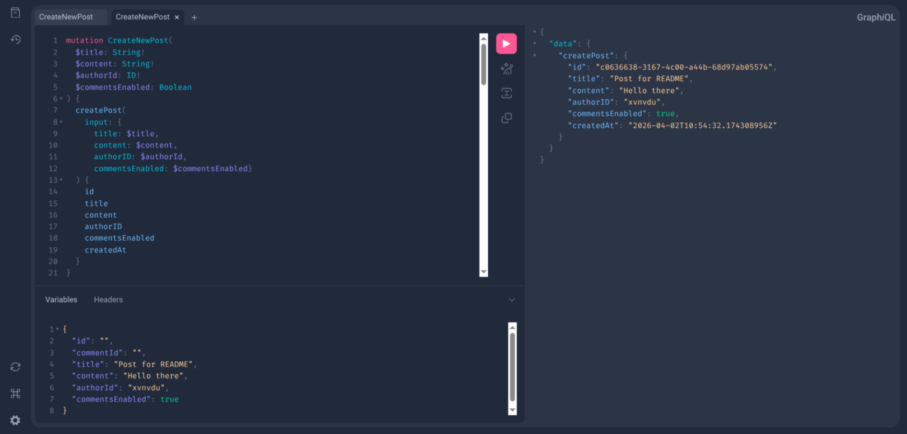
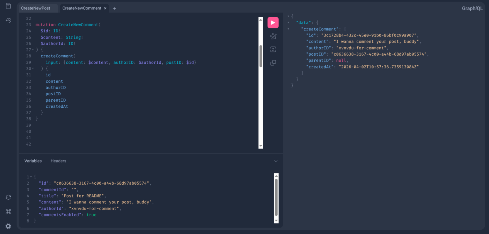
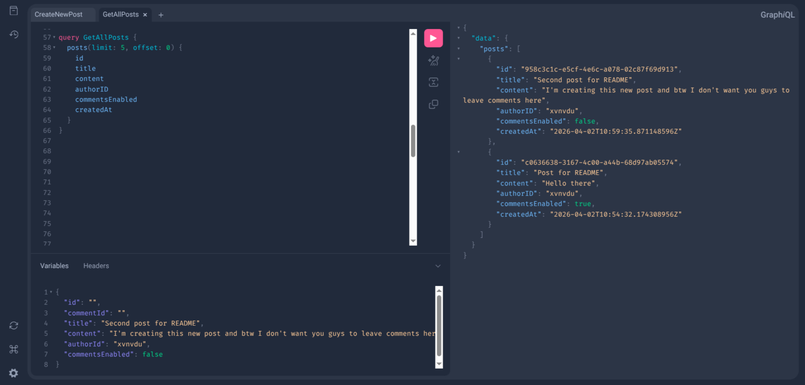

# Threads Service 
**Сервис для добавления и чтения постов и комментариев с использованием GraphQL**

## Скриншоты




## Функционал
- Создание постов и комментариев под ними
- Ответы на комментарии
- Просмотр списка постов или отдельного поста
- Просмотр комментариев под постом или другим комментарием
- Включение/выключение комментариев под постом (в т.ч. под существующим)
- Асинхронная доставка комментариев подписчикам поста через GraphQL Subscriptions
- Система пагинации при просмотре списка постов или комментариев

## Технологии
- **Язык:** Golang 1.25.3
- **API:** GraphQL
- **Контейнеризация:** Docker
- **Веб-сервер:** net/http
- **Моки:** mock/gomock (uber)
- **GraphQL фреймворк:** gqlgen
- **Хранилище:** In-memory maps

## Установка и запуск
### Требования и зависимости
1) Установите Docker на вашу систему соответствующим образом

### Подготовка к запуску
1) Перейдите в директорию, куда хотите сохранить сервис или создайте новую:
```
mkdir <YOUR-DIRECTORY-NAME> && cd <YOUR-DIRECTORY-NAME>
```
2) Клонируйте репозиторий проекта внутри директории и перейдите в него:
```
git clone https://github.com/xvnvdu/threads-service.git && cd threads-service
```
3) Запустите сборку образа и дождитесь ее окончания:
```
docker build -t threads-service .
```
4) Запустите контейнер:
```
docker run -p 8080:8080 threads-service -storage=<CHOOSE-OPTION>
```
Вы можете выбрать одну из двух опций хранения данных: ```inmemory``` или ```postgres```(еще не реализован)

Флаг опционален. По умолчанию будет использовано ```inmemory```


## Тестирование
### In-memory хранилище (98.4%)
1) Вы можете запустить тесты следующим образом:
```
go test -coverprofile=coverage.out ./internal/repository/inmemory/ -v
```
2) А также проверить покрытие в сгенерированном html файле:
```
go tool cover -html=coverage.out
```
<details>
<summary>Результаты тестирования in-memory хранилища</summary>

```
go test -coverprofile=coverage.out ./internal/repository/inmemory/ -v
=== RUN   TestInMemoryRepositoryGetPostByID
    inmemory_test.go:25: attempting to create post with AuthorID: user1, Title: Post 1
2026/04/03 04:33:44 [INFO] successfully created and saved post to in-memory storage: 7b5c4e12-1132-40b3-963d-e21f95396a83
    inmemory_test.go:28: successfully saved post with ID: 7b5c4e12-1132-40b3-963d-e21f95396a83
    inmemory_test.go:25: attempting to create post with AuthorID: user2, Title: Post 2
2026/04/03 04:33:44 [INFO] successfully created and saved post to in-memory storage: 09ece490-2403-4fe5-84cd-bc2a873285b2
    inmemory_test.go:28: successfully saved post with ID: 09ece490-2403-4fe5-84cd-bc2a873285b2
=== RUN   TestInMemoryRepositoryGetPostByID/Found_Post_1
    inmemory_test.go:71: attempting to get post by ID: 7b5c4e12-1132-40b3-963d-e21f95396a83
2026/04/03 04:33:44 [INFO] successfully retrieved post from in-memory storage: 7b5c4e12-1132-40b3-963d-e21f95396a83
    inmemory_test.go:77: successfully retrieved post with ID: 7b5c4e12-1132-40b3-963d-e21f95396a83
=== RUN   TestInMemoryRepositoryGetPostByID/Found_Post_2
    inmemory_test.go:71: attempting to get post by ID: 09ece490-2403-4fe5-84cd-bc2a873285b2
2026/04/03 04:33:44 [INFO] successfully retrieved post from in-memory storage: 09ece490-2403-4fe5-84cd-bc2a873285b2
    inmemory_test.go:77: successfully retrieved post with ID: 09ece490-2403-4fe5-84cd-bc2a873285b2
=== RUN   TestInMemoryRepositoryGetPostByID/Not_Found
    inmemory_test.go:71: attempting to get post by ID: non-existent-id
2026/04/03 04:33:44 [WARN] could not find post in in-memory storage: non-existent-id
    inmemory_test.go:79: post not found as expected.
--- PASS: TestInMemoryRepositoryGetPostByID (0.00s)
    --- PASS: TestInMemoryRepositoryGetPostByID/Found_Post_1 (0.00s)
    --- PASS: TestInMemoryRepositoryGetPostByID/Found_Post_2 (0.00s)
    --- PASS: TestInMemoryRepositoryGetPostByID/Not_Found (0.00s)
=== RUN   TestInMemoryRepositoryGetPostsPaginationAndSort
    inmemory_test.go:89: creating 5 test posts for pagination...
    inmemory_test.go:25: attempting to create post with AuthorID: user, Title: Post 5
2026/04/03 04:33:44 [INFO] successfully created and saved post to in-memory storage: 854c4daf-165b-4aa9-888d-346fd0b445eb
    inmemory_test.go:28: successfully saved post with ID: 854c4daf-165b-4aa9-888d-346fd0b445eb
    inmemory_test.go:25: attempting to create post with AuthorID: user, Title: Post 4
2026/04/03 04:33:44 [INFO] successfully created and saved post to in-memory storage: bf796856-888d-4e3e-ba78-ef55897c26fc
    inmemory_test.go:28: successfully saved post with ID: bf796856-888d-4e3e-ba78-ef55897c26fc
    inmemory_test.go:25: attempting to create post with AuthorID: user, Title: Post 3
2026/04/03 04:33:44 [INFO] successfully created and saved post to in-memory storage: bbda23e4-ad8d-44cd-b6d9-d0978c079d9c
    inmemory_test.go:28: successfully saved post with ID: bbda23e4-ad8d-44cd-b6d9-d0978c079d9c
    inmemory_test.go:25: attempting to create post with AuthorID: user, Title: Post 2
2026/04/03 04:33:44 [INFO] successfully created and saved post to in-memory storage: dc4bf845-431c-47c0-a853-26fad082be54
    inmemory_test.go:28: successfully saved post with ID: dc4bf845-431c-47c0-a853-26fad082be54
    inmemory_test.go:25: attempting to create post with AuthorID: user, Title: Post 1
2026/04/03 04:33:44 [INFO] successfully created and saved post to in-memory storage: 9d0020b6-8016-48d1-9c26-2a2df8aa33c3
    inmemory_test.go:28: successfully saved post with ID: 9d0020b6-8016-48d1-9c26-2a2df8aa33c3
    inmemory_test.go:104: posts created with IDs (newest to oldest): 9d0020b6-8016-48d1-9c26-2a2df8aa33c3, dc4bf845-431c-47c0-a853-26fad082be54, bbda23e4-ad8d-44cd-b6d9-d0978c079d9c, bf796856-888d-4e3e-ba78-ef55897c26fc, 854c4daf-165b-4aa9-888d-346fd0b445eb
=== RUN   TestInMemoryRepositoryGetPostsPaginationAndSort/First_2_posts
    inmemory_test.go:122: getting posts with Limit: 2, Offset: 0
2026/04/03 04:33:44 [INFO] successfully retrieved posts from in-memory storage
    inmemory_test.go:126: successfully retrieved 2 posts.
    inmemory_test.go:128:   [0] Post ID: 9d0020b6-8016-48d1-9c26-2a2df8aa33c3
    inmemory_test.go:128:   [1] Post ID: dc4bf845-431c-47c0-a853-26fad082be54
=== RUN   TestInMemoryRepositoryGetPostsPaginationAndSort/Next_2_posts
    inmemory_test.go:122: getting posts with Limit: 2, Offset: 2
2026/04/03 04:33:44 [INFO] successfully retrieved posts from in-memory storage
    inmemory_test.go:126: successfully retrieved 2 posts.
    inmemory_test.go:128:   [0] Post ID: bbda23e4-ad8d-44cd-b6d9-d0978c079d9c
    inmemory_test.go:128:   [1] Post ID: bf796856-888d-4e3e-ba78-ef55897c26fc
=== RUN   TestInMemoryRepositoryGetPostsPaginationAndSort/Last_post
    inmemory_test.go:122: getting posts with Limit: 2, Offset: 4
2026/04/03 04:33:44 [INFO] successfully retrieved posts from in-memory storage
    inmemory_test.go:126: successfully retrieved 1 posts.
    inmemory_test.go:128:   [0] Post ID: 854c4daf-165b-4aa9-888d-346fd0b445eb
=== RUN   TestInMemoryRepositoryGetPostsPaginationAndSort/All_posts
    inmemory_test.go:122: getting posts with Limit: 10, Offset: 0
2026/04/03 04:33:44 [INFO] successfully retrieved posts from in-memory storage
    inmemory_test.go:126: successfully retrieved 5 posts.
    inmemory_test.go:128:   [0] Post ID: 9d0020b6-8016-48d1-9c26-2a2df8aa33c3
    inmemory_test.go:128:   [1] Post ID: dc4bf845-431c-47c0-a853-26fad082be54
    inmemory_test.go:128:   [2] Post ID: bbda23e4-ad8d-44cd-b6d9-d0978c079d9c
    inmemory_test.go:128:   [3] Post ID: bf796856-888d-4e3e-ba78-ef55897c26fc
    inmemory_test.go:128:   [4] Post ID: 854c4daf-165b-4aa9-888d-346fd0b445eb
=== RUN   TestInMemoryRepositoryGetPostsPaginationAndSort/Large_limit
    inmemory_test.go:122: getting posts with Limit: 100, Offset: 0
2026/04/03 04:33:44 [INFO] successfully retrieved posts from in-memory storage
    inmemory_test.go:126: successfully retrieved 5 posts.
    inmemory_test.go:128:   [0] Post ID: 9d0020b6-8016-48d1-9c26-2a2df8aa33c3
    inmemory_test.go:128:   [1] Post ID: dc4bf845-431c-47c0-a853-26fad082be54
    inmemory_test.go:128:   [2] Post ID: bbda23e4-ad8d-44cd-b6d9-d0978c079d9c
    inmemory_test.go:128:   [3] Post ID: bf796856-888d-4e3e-ba78-ef55897c26fc
    inmemory_test.go:128:   [4] Post ID: 854c4daf-165b-4aa9-888d-346fd0b445eb
--- PASS: TestInMemoryRepositoryGetPostsPaginationAndSort (0.01s)
    --- PASS: TestInMemoryRepositoryGetPostsPaginationAndSort/First_2_posts (0.00s)
    --- PASS: TestInMemoryRepositoryGetPostsPaginationAndSort/Next_2_posts (0.00s)
    --- PASS: TestInMemoryRepositoryGetPostsPaginationAndSort/Last_post (0.00s)
    --- PASS: TestInMemoryRepositoryGetPostsPaginationAndSort/All_posts (0.00s)
    --- PASS: TestInMemoryRepositoryGetPostsPaginationAndSort/Large_limit (0.00s)
=== RUN   TestInMemoryRepositoryDeletePost
    inmemory_test.go:25: attempting to create post with AuthorID: user1, Title: Post 1
2026/04/03 04:33:44 [INFO] successfully created and saved post to in-memory storage: de214117-b513-407b-9392-8bee0660405a
    inmemory_test.go:28: successfully saved post with ID: de214117-b513-407b-9392-8bee0660405a
    inmemory_test.go:139: created post1 with ID: de214117-b513-407b-9392-8bee0660405a
    inmemory_test.go:45: attempting to create comment for PostID: de214117-b513-407b-9392-8bee0660405a, AuthorID: u1, ParentID: nil
2026/04/03 04:33:44 [INFO] successfully created and saved comment to in-memory storage: c03f3cf3-23c3-4173-a5ed-d4f8a7da76ca
    inmemory_test.go:48: successfully saved comment with ID: c03f3cf3-23c3-4173-a5ed-d4f8a7da76ca
    inmemory_test.go:141: created c1 with ID: c03f3cf3-23c3-4173-a5ed-d4f8a7da76ca
    inmemory_test.go:45: attempting to create comment for PostID: de214117-b513-407b-9392-8bee0660405a, AuthorID: u2, ParentID: c03f3cf3-23c3-4173-a5ed-d4f8a7da76ca
2026/04/03 04:33:44 [INFO] successfully created and saved comment to in-memory storage: 0d0c759a-a6e2-4abc-a03b-71ceb6e258bf
    inmemory_test.go:48: successfully saved comment with ID: 0d0c759a-a6e2-4abc-a03b-71ceb6e258bf
    inmemory_test.go:143: created c1_1 with ID: 0d0c759a-a6e2-4abc-a03b-71ceb6e258bf
    inmemory_test.go:45: attempting to create comment for PostID: de214117-b513-407b-9392-8bee0660405a, AuthorID: u3, ParentID: 0d0c759a-a6e2-4abc-a03b-71ceb6e258bf
2026/04/03 04:33:44 [INFO] successfully created and saved comment to in-memory storage: 4ec2abb9-d8a4-48e5-94bc-ec53e59dfc6c
    inmemory_test.go:48: successfully saved comment with ID: 4ec2abb9-d8a4-48e5-94bc-ec53e59dfc6c
    inmemory_test.go:145: created c1_1_1 with ID: 4ec2abb9-d8a4-48e5-94bc-ec53e59dfc6c
    inmemory_test.go:45: attempting to create comment for PostID: de214117-b513-407b-9392-8bee0660405a, AuthorID: u4, ParentID: nil
2026/04/03 04:33:44 [INFO] successfully created and saved comment to in-memory storage: 2ec8bf1b-3fd0-4796-9609-ec0477a5284b
    inmemory_test.go:48: successfully saved comment with ID: 2ec8bf1b-3fd0-4796-9609-ec0477a5284b
    inmemory_test.go:147: created c1_2 with ID: 2ec8bf1b-3fd0-4796-9609-ec0477a5284b
    inmemory_test.go:151: initial comment count: 4
    inmemory_test.go:154: attempting to delete post with ID: de214117-b513-407b-9392-8bee0660405a
2026/04/03 04:33:44 [INFO] successfully deleted post from in-memory storage: de214117-b513-407b-9392-8bee0660405a
    inmemory_test.go:157: post de214117-b513-407b-9392-8bee0660405a deleted successfully.
2026/04/03 04:33:44 [WARN] could not find post in in-memory storage: de214117-b513-407b-9392-8bee0660405a
    inmemory_test.go:163: post successfully verified as deleted.
    inmemory_test.go:166: verifying associated comments are deleted...
2026/04/03 04:33:44 [WARN] could not find comment in in-memory storage: c03f3cf3-23c3-4173-a5ed-d4f8a7da76ca
    inmemory_test.go:299: comment C1 (ID: c03f3cf3-23c3-4173-a5ed-d4f8a7da76ca) verified as deleted.
2026/04/03 04:33:44 [WARN] could not find comment in in-memory storage: 0d0c759a-a6e2-4abc-a03b-71ceb6e258bf
    inmemory_test.go:299: comment C1.1 (ID: 0d0c759a-a6e2-4abc-a03b-71ceb6e258bf) verified as deleted.
2026/04/03 04:33:44 [WARN] could not find comment in in-memory storage: 4ec2abb9-d8a4-48e5-94bc-ec53e59dfc6c
    inmemory_test.go:299: comment C1.1.1 (ID: 4ec2abb9-d8a4-48e5-94bc-ec53e59dfc6c) verified as deleted.
2026/04/03 04:33:44 [WARN] could not find comment in in-memory storage: 2ec8bf1b-3fd0-4796-9609-ec0477a5284b
    inmemory_test.go:299: comment C1.2 (ID: 2ec8bf1b-3fd0-4796-9609-ec0477a5284b) verified as deleted.
    inmemory_test.go:175: all comments associated with the post verified as deleted.
    inmemory_test.go:179: attempting to delete non-existent post ID: non-existent-id
    inmemory_test.go:182: correctly received expected error for non-existent post: post with ID non-existent-id not found, failed to delete
--- PASS: TestInMemoryRepositoryDeletePost (0.00s)
=== RUN   TestInMemoryRepositoryCreateComment
    inmemory_test.go:25: attempting to create post with AuthorID: user1, Title: Post 1
2026/04/03 04:33:44 [INFO] successfully created and saved post to in-memory storage: e8c98bb0-0b89-4fa9-8f9c-dea853fc3670
    inmemory_test.go:28: successfully saved post with ID: e8c98bb0-0b89-4fa9-8f9c-dea853fc3670
    inmemory_test.go:25: attempting to create post with AuthorID: user2, Title: Post 2
2026/04/03 04:33:44 [INFO] successfully created and saved post to in-memory storage: cf8e023f-d2a7-4a8e-8697-f2f5f0ff96fe
    inmemory_test.go:28: successfully saved post with ID: cf8e023f-d2a7-4a8e-8697-f2f5f0ff96fe
    inmemory_test.go:190: created post1 (ID: e8c98bb0-0b89-4fa9-8f9c-dea853fc3670, CommentsEnabled: true), post2 (ID: cf8e023f-d2a7-4a8e-8697-f2f5f0ff96fe, CommentsEnabled: false)
    inmemory_test.go:199: attempting to create comment for post1 (enabled)
2026/04/03 04:33:44 [INFO] successfully created and saved comment to in-memory storage: 20a88259-af93-4a86-919a-022527379da4
    inmemory_test.go:202: successfully created comment with ID: 20a88259-af93-4a86-919a-022527379da4
    inmemory_test.go:212: attempting to create reply for comment 20a88259-af93-4a86-919a-022527379da4 (PostID: e8c98bb0-0b89-4fa9-8f9c-dea853fc3670)
2026/04/03 04:33:44 [INFO] successfully created and saved comment to in-memory storage: 0db5562d-90a2-4395-ba23-4418eede3de4
    inmemory_test.go:215: successfully created reply with ID: 0db5562d-90a2-4395-ba23-4418eede3de4
    inmemory_test.go:224: attempting to create comment for post2 (disabled)
    inmemory_test.go:229: correctly received expected error for disabled comments: post with ID cf8e023f-d2a7-4a8e-8697-f2f5f0ff96fe does not allow comments
    inmemory_test.go:239: attempting to create comment for non-existent post ID: non-existent
    inmemory_test.go:244: correctly received expected error for non-existent post: cannot create comment, post with ID non-existent does not exist
    inmemory_test.go:255: attempting to create reply to non-existent parent ID: non-existent-parent
    inmemory_test.go:260: correctly received expected error for non-existent parent: cannot reply to nonexistent comment with ID non-existent-parent
--- PASS: TestInMemoryRepositoryCreateComment (0.00s)
=== RUN   TestInMemoryRepositoryGetCommentByID
    inmemory_test.go:25: attempting to create post with AuthorID: user1, Title: Post 1
2026/04/03 04:33:44 [INFO] successfully created and saved post to in-memory storage: 1f6cbf50-c855-48ea-973f-45fcd2a4b78c
    inmemory_test.go:28: successfully saved post with ID: 1f6cbf50-c855-48ea-973f-45fcd2a4b78c
    inmemory_test.go:45: attempting to create comment for PostID: 1f6cbf50-c855-48ea-973f-45fcd2a4b78c, AuthorID: user1, ParentID: nil
2026/04/03 04:33:44 [INFO] successfully created and saved comment to in-memory storage: d1bb456b-ba4a-453b-9f3d-4bb4c86a769a
    inmemory_test.go:48: successfully saved comment with ID: d1bb456b-ba4a-453b-9f3d-4bb4c86a769a
    inmemory_test.go:268: created comment with ID: d1bb456b-ba4a-453b-9f3d-4bb4c86a769a
=== RUN   TestInMemoryRepositoryGetCommentByID/Found_Comment
    inmemory_test.go:281: attempting to get comment by ID: d1bb456b-ba4a-453b-9f3d-4bb4c86a769a
2026/04/03 04:33:44 [INFO] successfully retrieved comment from in-memory storage: d1bb456b-ba4a-453b-9f3d-4bb4c86a769a
    inmemory_test.go:287: successfully retrieved comment with ID: d1bb456b-ba4a-453b-9f3d-4bb4c86a769a
=== RUN   TestInMemoryRepositoryGetCommentByID/Not_Found
    inmemory_test.go:281: attempting to get comment by ID: non-existent-id
2026/04/03 04:33:44 [WARN] could not find comment in in-memory storage: non-existent-id
    inmemory_test.go:289: comment not found as expected.
--- PASS: TestInMemoryRepositoryGetCommentByID (0.00s)
    --- PASS: TestInMemoryRepositoryGetCommentByID/Found_Comment (0.00s)
    --- PASS: TestInMemoryRepositoryGetCommentByID/Not_Found (0.00s)
=== RUN   TestInMemoryRepositoryDeleteComment
    inmemory_test.go:25: attempting to create post with AuthorID: user1, Title: Post 1
2026/04/03 04:33:44 [INFO] successfully created and saved post to in-memory storage: 36c39bd6-faca-48ad-84dc-1dc0aed19882
    inmemory_test.go:28: successfully saved post with ID: 36c39bd6-faca-48ad-84dc-1dc0aed19882
    inmemory_test.go:45: attempting to create comment for PostID: 36c39bd6-faca-48ad-84dc-1dc0aed19882, AuthorID: u1, ParentID: nil
2026/04/03 04:33:44 [INFO] successfully created and saved comment to in-memory storage: 24eaeab7-84ca-4164-99f0-de403d862958
    inmemory_test.go:48: successfully saved comment with ID: 24eaeab7-84ca-4164-99f0-de403d862958
    inmemory_test.go:45: attempting to create comment for PostID: 36c39bd6-faca-48ad-84dc-1dc0aed19882, AuthorID: u2, ParentID: 24eaeab7-84ca-4164-99f0-de403d862958
2026/04/03 04:33:44 [INFO] successfully created and saved comment to in-memory storage: 795e11e8-77af-439b-a32e-d5b8ee659fb5
    inmemory_test.go:48: successfully saved comment with ID: 795e11e8-77af-439b-a32e-d5b8ee659fb5
    inmemory_test.go:45: attempting to create comment for PostID: 36c39bd6-faca-48ad-84dc-1dc0aed19882, AuthorID: u3, ParentID: 795e11e8-77af-439b-a32e-d5b8ee659fb5
2026/04/03 04:33:44 [INFO] successfully created and saved comment to in-memory storage: d16cdb38-6826-41c1-a221-d4e6cf50551a
    inmemory_test.go:48: successfully saved comment with ID: d16cdb38-6826-41c1-a221-d4e6cf50551a
    inmemory_test.go:45: attempting to create comment for PostID: 36c39bd6-faca-48ad-84dc-1dc0aed19882, AuthorID: u4, ParentID: nil
2026/04/03 04:33:44 [INFO] successfully created and saved comment to in-memory storage: 27ce0fb7-a0df-4b2c-8001-e50880f935b4
    inmemory_test.go:48: successfully saved comment with ID: 27ce0fb7-a0df-4b2c-8001-e50880f935b4
    inmemory_test.go:45: attempting to create comment for PostID: 36c39bd6-faca-48ad-84dc-1dc0aed19882, AuthorID: u5, ParentID: nil
2026/04/03 04:33:44 [INFO] successfully created and saved comment to in-memory storage: f0907665-bae8-4bfa-a983-fa2766bdce37
    inmemory_test.go:48: successfully saved comment with ID: f0907665-bae8-4bfa-a983-fa2766bdce37
    inmemory_test.go:313: initial comments: C1(24eaeab7-84ca-4164-99f0-de403d862958), C1.1(795e11e8-77af-439b-a32e-d5b8ee659fb5), C1.1.1(d16cdb38-6826-41c1-a221-d4e6cf50551a), C1.2(27ce0fb7-a0df-4b2c-8001-e50880f935b4), C1.3(f0907665-bae8-4bfa-a983-fa2766bdce37)
    inmemory_test.go:317: initial total comment count in map: 5
    inmemory_test.go:321: attempting to delete comment ID: 24eaeab7-84ca-4164-99f0-de403d862958 (C1) and its branch...
2026/04/03 04:33:44 [INFO] successfully deleted comment from in-memory storage: 24eaeab7-84ca-4164-99f0-de403d862958
    inmemory_test.go:324: deletion of C1 branch (ID: 24eaeab7-84ca-4164-99f0-de403d862958) completed.
    inmemory_test.go:328: remaining comment count verified: 2
2026/04/03 04:33:44 [WARN] could not find comment in in-memory storage: 24eaeab7-84ca-4164-99f0-de403d862958
    inmemory_test.go:299: comment C1 (ID: 24eaeab7-84ca-4164-99f0-de403d862958) verified as deleted.
2026/04/03 04:33:44 [WARN] could not find comment in in-memory storage: 795e11e8-77af-439b-a32e-d5b8ee659fb5
    inmemory_test.go:299: comment C1.1 (ID: 795e11e8-77af-439b-a32e-d5b8ee659fb5) verified as deleted.
2026/04/03 04:33:44 [WARN] could not find comment in in-memory storage: d16cdb38-6826-41c1-a221-d4e6cf50551a
    inmemory_test.go:299: comment C1.1.1 (ID: d16cdb38-6826-41c1-a221-d4e6cf50551a) verified as deleted.
    inmemory_test.go:334: verifying C1.2 and C1.3 still exist...
    inmemory_test.go:336: C1.2 (ID: 27ce0fb7-a0df-4b2c-8001-e50880f935b4) still exists.
    inmemory_test.go:338: C1.3 (ID: f0907665-bae8-4bfa-a983-fa2766bdce37) still exists.
    inmemory_test.go:341: verifying commentsIndex state after deletion...
    inmemory_test.go:344: C1 (ID: 24eaeab7-84ca-4164-99f0-de403d862958) successfully removed as a parent from index.
    inmemory_test.go:352: attempting to delete non-existent comment ID: non-existent-id
    inmemory_test.go:355: correctly received expected error for non-existent comment: comment with ID non-existent-id not found, failed to delete
--- PASS: TestInMemoryRepositoryDeleteComment (0.00s)
=== RUN   TestInMemoryRepositorySetCommentsEnabled
    inmemory_test.go:25: attempting to create post with AuthorID: user1, Title: Post 1
2026/04/03 04:33:44 [INFO] successfully created and saved post to in-memory storage: 6a63a18c-6e6a-46f1-ac7b-68581eab6e02
    inmemory_test.go:28: successfully saved post with ID: 6a63a18c-6e6a-46f1-ac7b-68581eab6e02
    inmemory_test.go:362: initial post ID: 6a63a18c-6e6a-46f1-ac7b-68581eab6e02, CommentsEnabled: true
    inmemory_test.go:365: attempting to disable comments for post ID: 6a63a18c-6e6a-46f1-ac7b-68581eab6e02
2026/04/03 04:33:44 [INFO] successfully set CommentsEnabled: false
    inmemory_test.go:370: comments successfully disabled. Updated Post CommentsEnabled: false
    inmemory_test.go:373: attempting to enable comments for post ID: 6a63a18c-6e6a-46f1-ac7b-68581eab6e02
2026/04/03 04:33:44 [INFO] successfully set CommentsEnabled: true
    inmemory_test.go:378: comments successfully enabled. Updated Post CommentsEnabled: true
    inmemory_test.go:382: attempting to set comments enabled for non-existent post ID: non-existent-id
    inmemory_test.go:385: correctly received expected error for non-existent post: post with ID non-existent-id not found
--- PASS: TestInMemoryRepositorySetCommentsEnabled (0.00s)
=== RUN   TestInMemoryRepositoryGetComments
    inmemory_test.go:392: creating test post...
    inmemory_test.go:25: attempting to create post with AuthorID: user1, Title: Post
2026/04/03 04:33:44 [INFO] successfully created and saved post to in-memory storage: 26de43e3-df8f-4951-983d-691ff6d6bc31
    inmemory_test.go:28: successfully saved post with ID: 26de43e3-df8f-4951-983d-691ff6d6bc31
    inmemory_test.go:395: creating comments...
    inmemory_test.go:45: attempting to create comment for PostID: 26de43e3-df8f-4951-983d-691ff6d6bc31, AuthorID: u1, ParentID: nil
2026/04/03 04:33:44 [INFO] successfully created and saved comment to in-memory storage: 2c24b9c1-1425-4f3d-b8b5-3985bfa3914a
    inmemory_test.go:48: successfully saved comment with ID: 2c24b9c1-1425-4f3d-b8b5-3985bfa3914a
    inmemory_test.go:45: attempting to create comment for PostID: 26de43e3-df8f-4951-983d-691ff6d6bc31, AuthorID: u2, ParentID: nil
2026/04/03 04:33:44 [INFO] successfully created and saved comment to in-memory storage: fe6dad07-f688-471f-8c2b-20122d5a8fde
    inmemory_test.go:48: successfully saved comment with ID: fe6dad07-f688-471f-8c2b-20122d5a8fde
    inmemory_test.go:45: attempting to create comment for PostID: 26de43e3-df8f-4951-983d-691ff6d6bc31, AuthorID: u3, ParentID: nil
2026/04/03 04:33:44 [INFO] successfully created and saved comment to in-memory storage: 5f19a309-f7d3-4070-8145-80d115781dcf
    inmemory_test.go:48: successfully saved comment with ID: 5f19a309-f7d3-4070-8145-80d115781dcf
    inmemory_test.go:405: creating nested comments...
    inmemory_test.go:45: attempting to create comment for PostID: 26de43e3-df8f-4951-983d-691ff6d6bc31, AuthorID: u4, ParentID: 2c24b9c1-1425-4f3d-b8b5-3985bfa3914a
2026/04/03 04:33:44 [INFO] successfully created and saved comment to in-memory storage: d98fd023-c22a-4f3a-92fc-dadfc476d59e
    inmemory_test.go:48: successfully saved comment with ID: d98fd023-c22a-4f3a-92fc-dadfc476d59e
    inmemory_test.go:45: attempting to create comment for PostID: 26de43e3-df8f-4951-983d-691ff6d6bc31, AuthorID: u5, ParentID: 2c24b9c1-1425-4f3d-b8b5-3985bfa3914a
2026/04/03 04:33:44 [INFO] successfully created and saved comment to in-memory storage: 0ceb0cc8-d8d2-468d-af63-285668fb3d4f
    inmemory_test.go:48: successfully saved comment with ID: 0ceb0cc8-d8d2-468d-af63-285668fb3d4f
=== RUN   TestInMemoryRepositoryGetComments/Post_does_not_exist
    inmemory_test.go:489: getting comments: postID=non-existent, parentID=<nil>, limit=10, offset=0
    inmemory_test.go:496: received expected error: cannot get comments under nonexistent post with ID non-existent
=== RUN   TestInMemoryRepositoryGetComments/Get_root_comments_newest_first
    inmemory_test.go:489: getting comments: postID=26de43e3-df8f-4951-983d-691ff6d6bc31, parentID=<nil>, limit=10, offset=0
2026/04/03 04:33:44 [INFO] successfully retrieved comments from in-memory storage
    inmemory_test.go:510: successfully retrieved 3 comments
    inmemory_test.go:512:   [0] Comment ID: 5f19a309-f7d3-4070-8145-80d115781dcf
    inmemory_test.go:512:   [1] Comment ID: fe6dad07-f688-471f-8c2b-20122d5a8fde
    inmemory_test.go:512:   [2] Comment ID: 2c24b9c1-1425-4f3d-b8b5-3985bfa3914a
=== RUN   TestInMemoryRepositoryGetComments/Get_root_comments_oldest_first
    inmemory_test.go:489: getting comments: postID=26de43e3-df8f-4951-983d-691ff6d6bc31, parentID=<nil>, limit=10, offset=0
2026/04/03 04:33:44 [INFO] successfully retrieved comments from in-memory storage
    inmemory_test.go:510: successfully retrieved 3 comments
    inmemory_test.go:512:   [0] Comment ID: 2c24b9c1-1425-4f3d-b8b5-3985bfa3914a
    inmemory_test.go:512:   [1] Comment ID: fe6dad07-f688-471f-8c2b-20122d5a8fde
    inmemory_test.go:512:   [2] Comment ID: 5f19a309-f7d3-4070-8145-80d115781dcf
=== RUN   TestInMemoryRepositoryGetComments/Get_child_comments_(forced_oldest)
    inmemory_test.go:489: getting comments: postID=26de43e3-df8f-4951-983d-691ff6d6bc31, parentID=0xc000184c80, limit=10, offset=0
2026/04/03 04:33:44 [INFO] successfully retrieved comments from in-memory storage
    inmemory_test.go:510: successfully retrieved 2 comments
    inmemory_test.go:512:   [0] Comment ID: d98fd023-c22a-4f3a-92fc-dadfc476d59e
    inmemory_test.go:512:   [1] Comment ID: 0ceb0cc8-d8d2-468d-af63-285668fb3d4f
=== RUN   TestInMemoryRepositoryGetComments/Pagination_first_item
    inmemory_test.go:489: getting comments: postID=26de43e3-df8f-4951-983d-691ff6d6bc31, parentID=<nil>, limit=1, offset=0
2026/04/03 04:33:44 [INFO] successfully retrieved comments from in-memory storage
    inmemory_test.go:510: successfully retrieved 1 comments
    inmemory_test.go:512:   [0] Comment ID: 5f19a309-f7d3-4070-8145-80d115781dcf
=== RUN   TestInMemoryRepositoryGetComments/Pagination_second_item
    inmemory_test.go:489: getting comments: postID=26de43e3-df8f-4951-983d-691ff6d6bc31, parentID=<nil>, limit=1, offset=1
2026/04/03 04:33:44 [INFO] successfully retrieved comments from in-memory storage
    inmemory_test.go:510: successfully retrieved 1 comments
    inmemory_test.go:512:   [0] Comment ID: fe6dad07-f688-471f-8c2b-20122d5a8fde
=== RUN   TestInMemoryRepositoryGetComments/Offset_out_of_range
    inmemory_test.go:489: getting comments: postID=26de43e3-df8f-4951-983d-691ff6d6bc31, parentID=<nil>, limit=10, offset=100
    inmemory_test.go:510: successfully retrieved 0 comments
--- PASS: TestInMemoryRepositoryGetComments (0.01s)
    --- PASS: TestInMemoryRepositoryGetComments/Post_does_not_exist (0.00s)
    --- PASS: TestInMemoryRepositoryGetComments/Get_root_comments_newest_first (0.00s)
    --- PASS: TestInMemoryRepositoryGetComments/Get_root_comments_oldest_first (0.00s)
    --- PASS: TestInMemoryRepositoryGetComments/Get_child_comments_(forced_oldest) (0.00s)
    --- PASS: TestInMemoryRepositoryGetComments/Pagination_first_item (0.00s)
    --- PASS: TestInMemoryRepositoryGetComments/Pagination_second_item (0.00s)
    --- PASS: TestInMemoryRepositoryGetComments/Offset_out_of_range (0.00s)
PASS
coverage: 98.4% of statements
ok  	github.com/xvnvdu/threads-service/internal/repository/inmemory	0.020s	coverage: 98.4% of statements
```
</details>

### Service слой (вместе с подпиской на уведомления) (97.1%)
1) Запустите тесты следующей командой:
```
go test -coverprofile=coverage.out ./internal/service/ -v
```
2) После чего вы также можете проверить покрытие:
```
go tool cover -html=coverage.out
```

<details>
<summary>Результаты тестирования сервиса и подписки</summary>

```
go test -coverprofile=coverage.out ./internal/service/ -v
=== RUN   TestService_Subscription
2026/04/03 06:01:23 [INFO] pubsub: subscribed to post with id: post-for-sub
2026/04/03 06:01:23 [INFO] service: validated comment data: comment-sub-1
2026/04/03 06:01:23 [INFO] pubsub: published notification to all subscribers to post with id: post-for-sub
--- PASS: TestService_Subscription (0.00s)
=== RUN   TestServiceCreatePost
=== RUN   TestServiceCreatePost/successful_creation_with_empty_id_and_createdAt
2026/04/03 06:01:23 [INFO] service: validated post data: e55fa7cc-9bf3-43bf-817d-5b8d89070116
=== NAME  TestServiceCreatePost
    service_test.go:46: mock createPost called with id: e55fa7cc-9bf3-43bf-817d-5b8d89070116
=== NAME  TestServiceCreatePost/successful_creation_with_empty_id_and_createdAt
    service_test.go:131: post created: e55fa7cc-9bf3-43bf-817d-5b8d89070116
=== RUN   TestServiceCreatePost/empty_author_id
    service_test.go:124: received expected error: service: post cannot be created by author with empty id
=== RUN   TestServiceCreatePost/empty_title
    service_test.go:124: received expected error: service: cannot create post without a title
=== RUN   TestServiceCreatePost/empty_content
    service_test.go:124: received expected error: service: cannot create empty post
=== RUN   TestServiceCreatePost/repository_error
2026/04/03 06:01:23 [INFO] service: validated post data: 3f916d8c-d26c-401b-ad2a-653f9fb577e7
    service_test.go:124: received expected error: service: failed to create post: db error
=== RUN   TestServiceCreatePost/id_and_createdAt_already_set
2026/04/03 06:01:23 [INFO] service: validated post data: 3e8866c8-e054-4daa-9ab2-f60c85fe0fd1
    service_test.go:131: post created: 3e8866c8-e054-4daa-9ab2-f60c85fe0fd1
--- PASS: TestServiceCreatePost (0.00s)
    --- PASS: TestServiceCreatePost/successful_creation_with_empty_id_and_createdAt (0.00s)
    --- PASS: TestServiceCreatePost/empty_author_id (0.00s)
    --- PASS: TestServiceCreatePost/empty_title (0.00s)
    --- PASS: TestServiceCreatePost/empty_content (0.00s)
    --- PASS: TestServiceCreatePost/repository_error (0.00s)
    --- PASS: TestServiceCreatePost/id_and_createdAt_already_set (0.00s)
=== RUN   TestServiceGetPostByID
=== RUN   TestServiceGetPostByID/empty_id
    service_test.go:190: received expected error: service: cannot get post with empty id
=== RUN   TestServiceGetPostByID/successful_retrieval
2026/04/03 06:01:23 [INFO] service: validated id to get post data: post1
    service_test.go:197: post retrieved: post1
=== RUN   TestServiceGetPostByID/repository_error
2026/04/03 06:01:23 [INFO] service: validated id to get post data: post2
    service_test.go:190: received expected error: service: failed to get post by ID: db error
--- PASS: TestServiceGetPostByID (0.00s)
    --- PASS: TestServiceGetPostByID/empty_id (0.00s)
    --- PASS: TestServiceGetPostByID/successful_retrieval (0.00s)
    --- PASS: TestServiceGetPostByID/repository_error (0.00s)
=== RUN   TestServiceGetPosts
=== RUN   TestServiceGetPosts/successful_retrieval
2026/04/03 06:01:23 [INFO] service: validated limit and offset to get post data
    service_test.go:284: posts retrieved: 1
=== RUN   TestServiceGetPosts/invalid_limit
    service_test.go:277: received expected error: service: failed to get posts: limit must be positive and offset must be non-negative
=== RUN   TestServiceGetPosts/invalid_offset
    service_test.go:277: received expected error: service: failed to get posts: limit must be positive and offset must be non-negative
=== RUN   TestServiceGetPosts/limit_exceeds_max_pagination_limit
2026/04/03 06:01:23 [INFO] service: validated limit and offset to get post data
    service_test.go:284: posts retrieved: 1
=== RUN   TestServiceGetPosts/repository_error
2026/04/03 06:01:23 [INFO] service: validated limit and offset to get post data
    service_test.go:277: received expected error: service: failed to get posts: db error
--- PASS: TestServiceGetPosts (0.00s)
    --- PASS: TestServiceGetPosts/successful_retrieval (0.00s)
    --- PASS: TestServiceGetPosts/invalid_limit (0.00s)
    --- PASS: TestServiceGetPosts/invalid_offset (0.00s)
    --- PASS: TestServiceGetPosts/limit_exceeds_max_pagination_limit (0.00s)
    --- PASS: TestServiceGetPosts/repository_error (0.00s)
=== RUN   TestServiceSetCommentsEnabled
=== RUN   TestServiceSetCommentsEnabled/enable_comments
    service_test.go:366: comments state updated for post: post1
=== RUN   TestServiceSetCommentsEnabled/disable_comments
    service_test.go:366: comments state updated for post: post2
=== RUN   TestServiceSetCommentsEnabled/empty_post_id
    service_test.go:358: received expected error: service: cannot switch comments state: post id must not be empty
=== RUN   TestServiceSetCommentsEnabled/repository_error
    service_test.go:358: received expected error: service: failed to switch comments state for post with id post3: db error
--- PASS: TestServiceSetCommentsEnabled (0.00s)
    --- PASS: TestServiceSetCommentsEnabled/enable_comments (0.00s)
    --- PASS: TestServiceSetCommentsEnabled/disable_comments (0.00s)
    --- PASS: TestServiceSetCommentsEnabled/empty_post_id (0.00s)
    --- PASS: TestServiceSetCommentsEnabled/repository_error (0.00s)
=== RUN   TestServiceDeletePost
=== RUN   TestServiceDeletePost/successful_deletion
2026/04/03 06:01:23 [INFO] service: validated id to delete post: post1
    service_test.go:431: post deleted successfully: post1
=== RUN   TestServiceDeletePost/empty_post_id
    service_test.go:426: received expected error: service: cannot delete post with empty id
=== RUN   TestServiceDeletePost/repo_error
2026/04/03 06:01:23 [INFO] service: validated id to delete post: post2
    service_test.go:426: received expected error: service: failed to delete post: db error
--- PASS: TestServiceDeletePost (0.00s)
    --- PASS: TestServiceDeletePost/successful_deletion (0.00s)
    --- PASS: TestServiceDeletePost/empty_post_id (0.00s)
    --- PASS: TestServiceDeletePost/repo_error (0.00s)
=== RUN   TestServiceCreateComment
=== RUN   TestServiceCreateComment/successful_creation
2026/04/03 06:01:23 [INFO] service: validated comment data: ae2fb6f7-6996-4a7e-a089-3dea7111afc5
2026/04/03 06:01:23 [INFO] pubsub: published notification to all subscribers to post with id: post1
    service_test.go:544: comment created: ae2fb6f7-6996-4a7e-a089-3dea7111afc5
=== RUN   TestServiceCreateComment/content_exceeds_max_length
    service_test.go:537: received expected error: service: failed to create comment: comment content exceeds maximum allowed length
=== RUN   TestServiceCreateComment/empty_content
    service_test.go:537: received expected error: service: failed to create comment: comment must not be empty
=== RUN   TestServiceCreateComment/empty_author_id
    service_test.go:537: received expected error: service: failed to create comment: comment must have its author with non-empty id
=== RUN   TestServiceCreateComment/empty_author_id#01
    service_test.go:537: received expected error: service: failed to create comment: comment must have its author with non-empty id
=== RUN   TestServiceCreateComment/repository_error
2026/04/03 06:01:23 [INFO] service: validated comment data: 00aa26d9-0987-4545-8755-e1bb89619219
    service_test.go:537: received expected error: service: failed to create comment: db error
--- PASS: TestServiceCreateComment (0.00s)
    --- PASS: TestServiceCreateComment/successful_creation (0.00s)
    --- PASS: TestServiceCreateComment/content_exceeds_max_length (0.00s)
    --- PASS: TestServiceCreateComment/empty_content (0.00s)
    --- PASS: TestServiceCreateComment/empty_author_id (0.00s)
    --- PASS: TestServiceCreateComment/empty_author_id#01 (0.00s)
    --- PASS: TestServiceCreateComment/repository_error (0.00s)
=== RUN   TestServiceGetCommentByID
=== RUN   TestServiceGetCommentByID/success
2026/04/03 06:01:23 [INFO] service: validated id to get post data: c1
    service_test.go:612: comment retrieved successfully: &{ID:c1 PostID: ParentID:<nil> Content: AuthorID: CreatedAt:0001-01-01 00:00:00 +0000 UTC Children:[]}
=== RUN   TestServiceGetCommentByID/empty_id
    service_test.go:604: received expected error: service: cannot get comment with empty id
=== RUN   TestServiceGetCommentByID/repo_error
2026/04/03 06:01:23 [INFO] service: validated id to get post data: c2
    service_test.go:604: received expected error: service: failed to get comment by id: db error
--- PASS: TestServiceGetCommentByID (0.00s)
    --- PASS: TestServiceGetCommentByID/success (0.00s)
    --- PASS: TestServiceGetCommentByID/empty_id (0.00s)
    --- PASS: TestServiceGetCommentByID/repo_error (0.00s)
=== RUN   TestServiceGetComments
=== RUN   TestServiceGetComments/top_level_comments
2026/04/03 06:01:23 [INFO] service: validated data to get comments
    service_test.go:718: comments retrieved successfully: [0xc0000d0d80]
=== RUN   TestServiceGetComments/child_comments_force_oldest
2026/04/03 06:01:23 [INFO] service: validated data to get comments
    service_test.go:718: comments retrieved successfully: [0xc0000d0e00]
=== RUN   TestServiceGetComments/limit_exceeds_max_pagination_limit
2026/04/03 06:01:23 [INFO] service: validated data to get comments
    service_test.go:718: comments retrieved successfully: [0xc0000d0e80]
=== RUN   TestServiceGetComments/invalid_pagination
    service_test.go:711: received expected error: service: failed to get comments: limit must be positive and offset must be non-negative
=== RUN   TestServiceGetComments/repo_error
2026/04/03 06:01:23 [INFO] service: validated data to get comments
    service_test.go:711: received expected error: service: failed to get comments: db error
--- PASS: TestServiceGetComments (0.00s)
    --- PASS: TestServiceGetComments/top_level_comments (0.00s)
    --- PASS: TestServiceGetComments/child_comments_force_oldest (0.00s)
    --- PASS: TestServiceGetComments/limit_exceeds_max_pagination_limit (0.00s)
    --- PASS: TestServiceGetComments/invalid_pagination (0.00s)
    --- PASS: TestServiceGetComments/repo_error (0.00s)
=== RUN   TestServiceDeleteComment
=== RUN   TestServiceDeleteComment/success
2026/04/03 06:01:23 [INFO] service: validated id to delete post: c1
    service_test.go:783: comment deleted: c1
=== RUN   TestServiceDeleteComment/empty_id
    service_test.go:778: received expected error: service: cannot delete comment with empty id
=== RUN   TestServiceDeleteComment/repo_error
2026/04/03 06:01:23 [INFO] service: validated id to delete post: c2
    service_test.go:778: received expected error: service: failed to delete comment: db error
--- PASS: TestServiceDeleteComment (0.00s)
    --- PASS: TestServiceDeleteComment/success (0.00s)
    --- PASS: TestServiceDeleteComment/empty_id (0.00s)
    --- PASS: TestServiceDeleteComment/repo_error (0.00s)
PASS
coverage: 97.1% of statements
ok  	github.com/xvnvdu/threads-service/internal/service	0.004s	coverage: 97.1% of statements
```
</details>


## Архитектура
1) **```cmd/server/main.go```**
- Основной исполняемый файл 
- Инициализирует зависимости
- Запускает HTTP-сервер

2) **```internal/domain/```**
- Содержит модели основных сущностей сервиса

3) **```internal/graph/```**
- Модуль, сгенерированный через gqlgen
- Содержит модели для работы gqlgen и GraphQL схему
- Реализованы резолверы для общения с сервисным слоем

4) **```internal/repository/inmemory```**
- In-memory хранилище на основе мап
- Тестирование in-memory хранилища

5) **```internal/repository/mocks```**
- Моки для интерфейса репозитория, сгенерированные через mock/gomock

6) **```internal/service/```**
- Сервисный слой приложения:
    - Содержит бизнес-логику для валидации данных и их передачи в репозиторий
    - Реализована подписка на получение новых комментариев для поста 
    - Тестирование сервисного слоя и подписки

7) **```gqlgen.yml```**
- Конфиг-файл для генерации кода через фреймворк gqlgen

## Полезное

### 🔮 GraphQL Cheat Sheet
#### **Переменные:**
```
{
  "postId": "<INSERT_YOUR_VALUE>",
  "commentId": "<INSERT_YOUR_VALUE>",
  "parentId": null,
  "content": "<INSERT_YOUR_VALUE>",
  "title": "<INSERT_YOUR_VALUE>",
  "authorId": "<INSERT_YOUR_VALUE>",
  "commentsEnabled": true,
  "limit": 10,
  "offset": 0,
  "enabled": false
}
```
#### **Мутации:**
CreatePost
```
mutation CreateNewPost($title: String!, $content: String!, $authorId: ID!, $commentsEnabled: Boolean) {
  createPost(
    input: {
      title: $title
      content: $content
      authorID: $authorId
      commentsEnabled: $commentsEnabled
    }
  ) {
    id
    title
    content
    authorID
    commentsEnabled
    createdAt
  }
}
```
CreateComment
```
mutation CreateNewComment($postId: ID!, $content: String!, $authorId: ID!, $parentId: ID) {
  createComment(
    input: {
      content: $content
      authorID: $authorId
      postID: $postId
      parentID: $parentId
    }
  ) {
    id
    content
    authorID
    postID
    parentID
    createdAt
  }
}
```
SetCommentsEnabled 
```
mutation EnableComments($postId: ID!, $enabled: Boolean!) {
  setCommentsEnabled(postID: $postId, enabled: $enabled) {
    id
    title
    commentsEnabled
  }
}
```
DeletePost 
```
mutation RemovePost($postId: ID!) {
  deletePost(id: $postId)
}
```
DeleteComment 
```
mutation RemoveComment($commentId: ID!) {
  deleteComment(id: $commentId)
}
```
#### **Запросы:**
GetPostByID
```
query GetPostByID($postId: ID!) {
  post(id: $postId) {
    id
    title
    content
    createdAt
  }
}
```
GetPosts
```
query GetListOfPosts($limit: Int!, $offset: Int!) {
  posts(limit: $limit, offset: $offset) {
    id
    title
    content
    authorID
    commentsEnabled
    createdAt
  }
}
```
GetCommentByID
```
query GetCommentByID($commentId: ID!) {
  comment(id: $commentId) {
    id
    content
    authorID
    postID
    parentID
    createdAt
  }
}
```
GetComments 
```
query GetComments($postId: ID!, $parentId: ID, $limit: Int!, $offset: Int!) {
  comments(
    postID: $postId
    parentID: $parentId
    limit: $limit
    offset: $offset
  ) {
    id
    postID
    content
    authorID
    parentID
    createdAt
  }
}
```
#### **Подписка:**
```
subscription Subscribe($postId: ID!) {
  commentAdded(postID: $postId) {
    id
    postID
    content
    authorID
    createdAt
  }
}
```

### ⚠️ Поля Post.Comments и Comment.Children
**Проблема:** в текущей реализации приложения объекты Post и Comment не хранят в себе
списки комментариев и детей соответственно. То есть, при попытке получить, например, пост
с явным запросом комментариев:
```
query GetSinglePost($id: ID!) {
  post(id: $id) {
    id
    title
    content
    createdAt
    comments(offset:0, limit:10){
      id
    }
  }
}
```
Список комментариев будет пустым из-за того, что в приложении не происходит его наполнение:
```
{
  "data": {
    "post": {
      "id": "1910cbe6-9d03-434c-8a4c-46d0c42e3678",
      "title": "My post",
      "content": "Hello world 123",
      "createdAt": "2026-04-02T13:05:47.386857975+03:00",
      "comments": []
    }
  }
}
```
При этом все еще можно без проблем получить список комментариев через GetComments, явно указав желаемый пост:
```
{
  "data": {
    "comments": [
      {
        "id": "2cffed28-dbe9-4d50-b56f-82461428caa5",
        "postID": "1910cbe6-9d03-434c-8a4c-46d0c42e3678",
        "content": "Such a boring post lmao",
        "authorID": "author-999",
        "parentID": null,
        "createdAt": "2026-04-02T13:12:32.471617531+03:00"
      },
      {
        "id": "45e9eeb4-12bf-400b-8a40-8654864c7450",
        "postID": "1910cbe6-9d03-434c-8a4c-46d0c42e3678",
        "content": "Oh hey there",
        "authorID": "author-222",
        "parentID": null,
        "createdAt": "2026-04-02T13:10:22.056288681+03:00"
      }
    ]
  }
}
```
**Почему так ?:** хотя эти поля существуют и, в целом, можно реализовать подобный функционал, сделано это
было для того, чтобы не перегружать сервис рекурсией и не усложнять имеющуюся логику.

**А что можно сделать ?:** по большому счету, достаточно реализовать дополнительный рекурсивный метод,
который будет собирать дерево комментариев из запрашиваемых root (для текущего уровня) комментов.

**И как это будет выглядеть ?:** мы можем задать своего рода guardrails, чтобы рекурсия не уходила слишком глубоко,
когда нам это не нужно. Например, нам достаточно собрать только ```limit``` комментариев верхнего уровня с указанным ```offset```, если нас не интересуют дети этих комментариев.
То есть просто вернуть "плоский" список. Если же мы требуется получить список комментариев с указанием их детей, не важно под постом или в качестве ответа на другой 
комментарий (логика та же), то нужно добавить ограничение глубины и ограничение количества элементов по ```limit``` на каждом "уровне" дерева.
Однако тут у нас, опять же, повышается нагрузка и API становится менее гибким, потому что клиент по сути не управляет глубиной и
всегда получает заранее сформированную структуру

Идеальным вариантом, пожалуй, была бы реализация полей-резолверов для ```comments``` и ```children```, чтобы API сам решал,
когда нам нужно подгружать комментарии, как и сколько.
